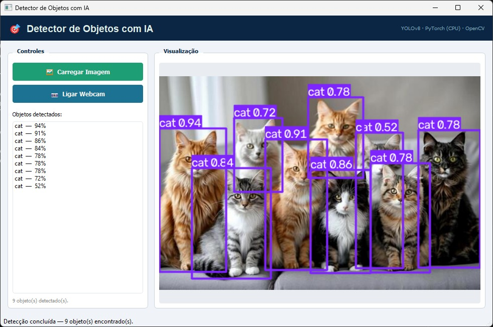

# 🎯 Detector de Objetos com IA

Aplicação desktop em Python que detecta e identifica objetos — em fotos ou pela webcam —
usando o modelo **YOLOv8** (Ultralytics) sobre **PyTorch**, com interface gráfica em
**PyQt5**.

Reconhece 80 categorias de objetos (pessoas, carros, animais, celulares, entre outros),
desenhando uma caixa ao redor de cada um com o nome e o grau de confiança da detecção.



---

## 🚀 Funcionalidades

- ✅ Detecção de objetos em imagens carregadas do computador
- ✅ Detecção em tempo real pela webcam
- ✅ Lista lateral com todos os objetos detectados e a confiança de cada um
- ✅ 80 categorias de objetos (dataset COCO)
- ✅ Modelo e confiança mínima configuráveis em duas constantes
- ✅ Roda 100% em CPU — não exige GPU dedicada

---

## 🔬 Comparação de modelos

Teste com a mesma foto (um grupo de gatos) e confiança mínima de 50%:

| Modelo | Objetos detectados | Confiança das detecções |
|---|---|---|
| YOLOv8n (nano) | 6 | 55% – 82% |
| YOLOv8s (small) | 9 | 52% – 94% |

O modelo **small** encontrou mais objetos — inclusive gatos parcialmente escondidos atrás
de outros — e com mais confiança, mas é mais pesado: em CPU, isso pesa principalmente no
modo webcam. Já o **nano** é a melhor escolha para computadores mais lentos ou para
detecção em tempo real.

Para trocar de modelo, edite as duas constantes no topo do `main_window.py`:

```python
MODELO = "yolov8s.pt"     # "yolov8n.pt" = mais rápido · "yolov8s.pt" = mais preciso
CONFIANCA_MINIMA = 0.5    # de 0 a 1 — detecções abaixo desse valor são descartadas
```

---

## 💡 Por que roda em CPU, e não na GPU?

Este projeto usa PyTorch em modo CPU deliberadamente. O foco aqui é demonstrar a
**integração** de um modelo de IA já treinado dentro de uma aplicação real — habilidade
central para um desenvolvedor — e não o treinamento do modelo em si, que é tarefa de
um cientista de dados.

Isso também torna o projeto compatível com qualquer computador, já que a aceleração por
GPU depende de hardware e drivers específicos (CUDA para NVIDIA, ROCm para AMD — este
último com suporte ainda limitado no Windows para a maioria das placas). Para manter a
detecção viável sem GPU, o projeto usa os modelos mais leves da família YOLOv8 (nano e
small).

---

## 🛠️ Tecnologias


**Modelo:** YOLOv8 (Ultralytics) · **Dataset:** COCO (80 categorias)

---

## 📁 Estrutura do projeto

```
detector-objetos-ia/
├── main.py             # Ponto de entrada da aplicação
├── main_window.py      # Interface gráfica (PyQt5) e configurações do detector
├── detector.py         # Encapsula o modelo YOLO
├── requirements.txt
└── screenshot.png
```

---

## ⚙️ Como executar

Testado com Python 3.14 no Windows 11.

### 1. Clone o repositório
```bash
git clone https://github.com/seu-usuario/detector-objetos-ia.git
cd detector-objetos-ia
```

### 2. Instale as dependências
```bash
pip install -r requirements.txt
```

> ⚠️ O PyTorch é uma biblioteca grande — a instalação pode levar alguns minutos.

### 3. Execute a aplicação
```bash
python main.py
```

### 4. Use a aplicação
- Clique em **Carregar Imagem** para detectar objetos em uma foto, ou
- Clique em **Ligar Webcam** para detecção em tempo real

> 🕐 Na primeira detecção, o modelo é baixado automaticamente da internet
> (cerca de 22 MB o small, 6 MB o nano). As execuções seguintes já usam o modelo
> salvo localmente.

---

## 🩹 Problemas comuns

**Windows: `WinError 1114` ao abrir (falha ao carregar `c10.dll`)**
Conflito conhecido entre o PyTorch e o PyQt quando o PyQt é carregado primeiro. O
`main.py` já importa o `torch` antes do PyQt5 e do OpenCV por esse motivo — não altere
essa ordem. Se o erro persistir, instale o
[Microsoft Visual C++ Redistributable (x64)](https://aka.ms/vs/17/release/vc_redist.x64.exe)
e reinicie o computador.

**Webcam não encontrada**
Use o botão **Carregar Imagem** para testar com uma foto.

---

## 🔮 Possíveis melhorias

- Seletor de modelo e controle deslizante de confiança direto na interface
- Nomes das categorias traduzidos para português
- Contagem de objetos por categoria

---

## 👨‍💻 Autor

**Matheus Bittencourt**  
[](https://www.linkedin.com/in/matheus-bittencourt-3b31a3177)
[](https://github.com/mathbittencourt10-netizen)
